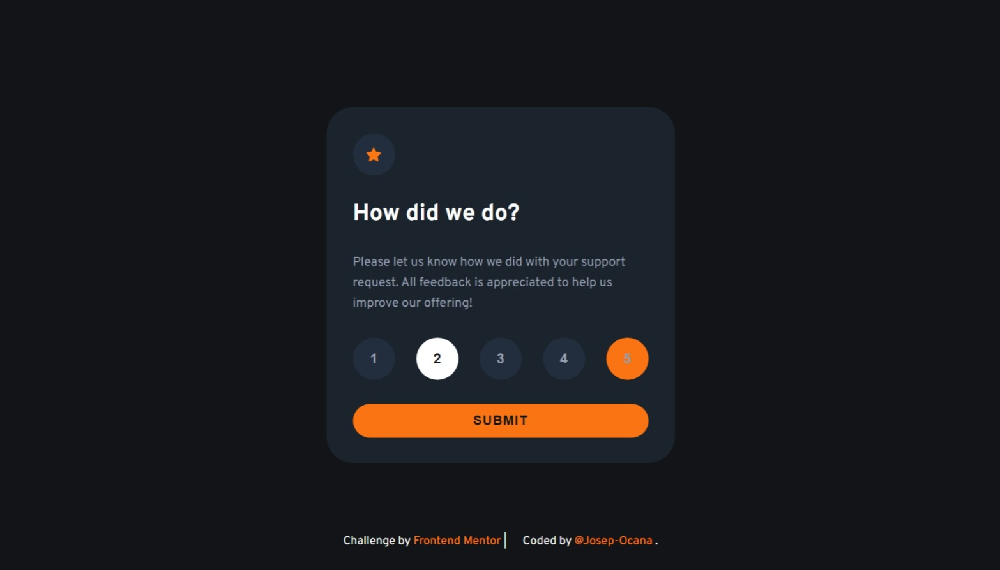

# Frontend Mentor - Interactive rating component solution

This is a solution to the [Interactive rating component challenge on Frontend Mentor](https://www.frontendmentor.io/challenges/interactive-rating-component-koxpeBUmI). Frontend Mentor challenges help you improve your coding skills by building realistic projects.

## Table of contents

-   [Overview](#overview)
    -   [The challenge](#the-challenge)
    -   [Screenshots](#screenshots)
    -   [Links](#links)
-   [My process](#my-process)
    -   [Built with](#built-with)
    -   [What I learned](#what-i-learned)
    -   [Continued development](#continued-development)
    -   [Useful resources](#useful-resources)
-   [Author](#author)
-   [Acknowledgments](#acknowledgments)

## Overview

### The challenge

Users should be able to:

-   View the optimal layout for the app depending on their device's screen size
-   See hover states for all interactive elements on the page
-   Select and submit a number rating
-   See the "Thank you" card state after submitting a rating

### Screenshots

#### Desktop design

#### Desktop thankyou design

#### Desktop active states

#### Mobile design

#### Mobile thankyou design

### Links

-   Solution URL: [My solution](https://github.com/Josep-Ocana/fm-interactive-rating-component-main)
-   Live Site URL: [Add live site URL here](https://your-live-site-url.com)

## My process

### Built with

-   Semantic HTML5 markup
-   [SASS](https://sass-lang.com/) - For styles.
-   Flexbox
-   [Node.js](https://nodejs.org/en)
-   [Vite](https://vitejs.dev/)

### What I learned

In this project I have continued how use the array methods and work with js.  
I'm also learnt to doing deployments, that they are complicated to do.

### Continued development

I want continue doing projects to improve in all areas: html, Sass , Js, deployments , etc...

### Useful resources

-   [Chat GPT](https://chatgpt.com/) - This help me to any problem that I can have. It's so useful!!!!

## Author

-   Frontend Mentor - [@Josep-Ocana](https://www.frontendmentor.io/profile/Josep-Ocana)

## Acknowledgments

-   I would like to thank frontend mentor for doing these exercises that help us to improve and refine our code.

-   I would also like to thank my family for motivating me and for his support.😘
